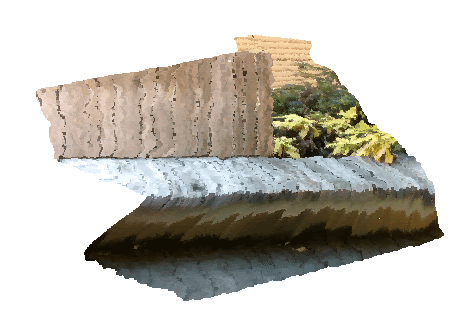
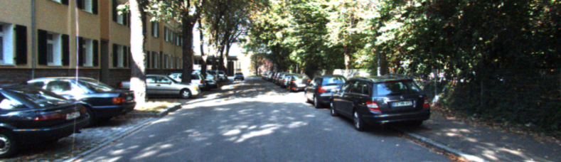
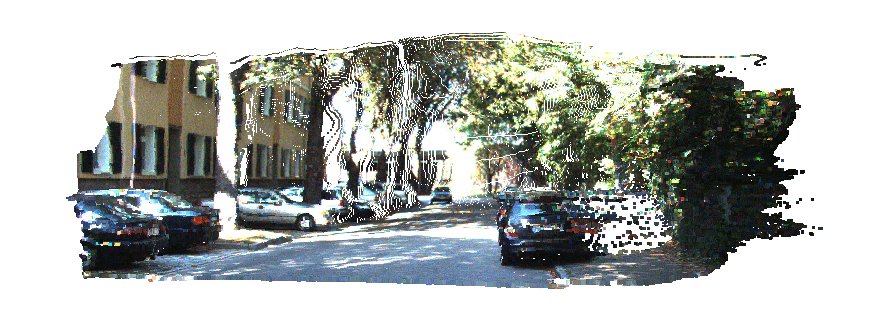
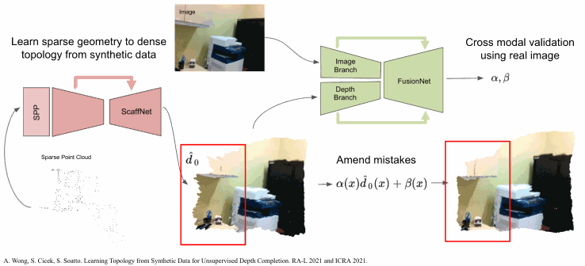

# Learning Topology from Synthetic Data for Unsupervised Depth Completion

Tensorflow implementation of *Learning Topology from Synthetic Data for Unsupervised Depth Completion*

Published in RA-L January 2021 and ICRA 2021

[[publication]](https://ieeexplore.ieee.org/document/9351588) [[arxiv]](https://arxiv.org/pdf/2106.02994v1.pdf) [[talk]](https://www.youtube.com/watch?v=zGKH-OKPJD4)

Model have been tested on Ubuntu 16.04, 20.04 using Python 3.5, 3.6, Tensorflow 1.14, 1.15

Authors: [Alex Wong](http://web.cs.ucla.edu/~alexw/), [Safa Cicek](https://bsafacicek.github.io/)

If this work is useful to you, please cite our paper:
```
@article{wong2021learning,
    title={Learning topology from synthetic data for unsupervised depth completion},
    author={Wong, Alex and Cicek, Safa and Soatto, Stefano},
    journal={IEEE Robotics and Automation Letters},
    volume={6},
    number={2},
    pages={1495--1502},
    year={2021},
    publisher={IEEE}
}
```

### Looking our latest work in unsupervised depth completion?

Checkout our ICCV 2021 oral paper, [KBNet][kbnet_github]: *Unsupervised Depth Completion with Calibrated Backprojection Layers*

[KBNet][kbnet_github] runs at 15 ms/frame (67 fps) and improves over VOICED by 51.7% on indoors (VOID) and 13.7% on outdoors (KITTI)!

### Coming soon!
Thanks for all the interest and inquiries! 

We are planning on releasing PyTorch versions of VOICED and ScaffNet over the coming months!

**Table of Contents**
1. [About sparse-to-dense depth completion](#about-sparse-to-dense)
2. [About ScaffNet and FusionNet](#about-scaffnet-fusionnet)
3. [Setting up](#setting-up)
4. [Downloading pretrained models](#downloading-pretrained-models)
4. [Running ScaffNet and FusionNet](#running-scaffnet-fusionnet)
6. [Training ScaffNet and FusionNet](#training-scaffnet-fusionnet)
7. [Related projects](#related-projects)
8. [License and disclaimer](#license-disclaimer)

## About sparse-to-dense depth completion <a name="about-sparse-to-dense"></a>
In the sparse-to-dense depth completion problem, we seek to infer the dense depth map of a 3-D scene using an RGB image and its associated sparse depth measurements in the form of a sparse depth map, obtained either from computational methods such as SfM (Strcuture-from-Motion) or active sensors such as lidar or structured light sensors.

| *RGB image from the VOID dataset*    | *Our densified depth map -- colored and backprojected to 3D* |
| :----------------------------------------: | :--------------------------------------------------------: |
|  |  |

| *RGB image from the KITTI dataset*    | *Our densified depth map -- colored and backprojected to 3D* |
| :-----------------------------------------: | :--------------------------------------------------------: |
|  |  |

To follow the literature and benchmarks for this task, you may visit:
[Awesome State of Depth Completion](https://github.com/alexklwong/awesome-state-of-depth-completion)

## About ScaffNet and FusionNet <a name="about-scaffnet-fusionnet"></a>
We propose a method that leverages the abundance of synthetic data (where groundtruth comes for free) and unannotated real data to learn cross modal fusion for depth completion.

**The challenge of Sim2Real:** There exists a covariate shift, mostly photometric, between synthetic and real domains, making it difficult to transfer models trained on synthetic source data to the target real data. Instead one might observe that, unlike photometry, the geometry persists for a given scene across domains.
So we can bypass the photometric domain gap by learning the association *not* from photometry to geometry or from images to shapes, but from sparse geometry (point clouds) to topology by using the abundance of synthetic data. In doing so we can bypass the synthetic to real domain gap without having to face concerns about covariate shift and domain adaptation.

**ScaffNet:** The challenge of sparse-to-dense depth comppletion is precisely the sparsity. To learn a representation of the sparse point cloud that can capture the complex geometry of objects, we introduce *ScaffNet*, an encoder decoder network augmented with our version of Spatial Pyramid Pooling (SPP) module. Our SPP module performs max pooling with various kernel sizes to densify the inputs and to capture different receptive fields and learns to balance the tradeoff between density and details of the sparse point cloud.

**FusionNet:** Because the topology estimated by ScaffNet is only informed by sparse points, if there are very few points or no points at all then we can expect the performance of ScaffNet to degrade. This is where the image comes back into the picture. We propose a second network that refines the initial estimate by incorporating the information from the image to amend any mistakes. Here we show our full inference pipeline:

<p align="center">
    
</p>

First, ScaffNet estimates an initial scene topology from the sparse point cloud.
Then FusionNet performs cross modality fusion and learns the residual beta from the image to refine the coarse topology estimate. By learning the residual around the initial estimate, we alleviate Fusionnet from the need to learn depth from scratch, which allows us to achieve better results with fewer parameters and faster inference.

## Setting up your virtual environment <a name="setting-up"></a>
We will create a virtual environment with the necessary dependencies
```
virtualenv -p /usr/bin/python3 scaffnet-fusionnet-py3env
source scaffnet-fusionnet-py3env/bin/activate
pip install opencv-python scipy scikit-learn scikit-image Pillow matplotlib gdown
pip install tensorflow-gpu==1.15
```

## Setting up your datasets
For datasets, we will use [Virtual KITTI 1][vkitti_dataset] and [KITTI][kitti_dataset] for outdoors and [SceneNet][scenenet_dataset] and [VOID][void_github] for indoors.
```
mkdir data
ln -s /path/to/virtual_kitti data/
ln -s /path/to/kitti_raw_data data/
ln -s /path/to/kitti_depth_completion data/
ln -s /path/to/scenenet data/
ln -s /path/to/void_release data/
```

In case you do not already have KITTI and VOID datasets downloaded, we provide download scripts for them:
```
bash bash/setup_dataset_kitti.sh
bash bash/setup_dataset_void.sh
```

The `bash/setup_dataset_void.sh` script downloads the VOID dataset using gdown. However, gdown intermittently fails. As a workaround, you may download them via:
```
https://drive.google.com/open?id=1kZ6ALxCzhQP8Tq1enMyNhjclVNzG8ODA
https://drive.google.com/open?id=1ys5EwYK6i8yvLcln6Av6GwxOhMGb068m
https://drive.google.com/open?id=1bTM5eh9wQ4U8p2ANOGbhZqTvDOddFnlI
```
which will give you three files `void_150.zip`, `void_500.zip`, `void_1500.zip`.

Assuming you are in the root of the repository, to construct the same dataset structure as the setup script above:
```
mkdir void_release
unzip -o void_150.zip -d void_release/
unzip -o void_500.zip -d void_release/
unzip -o void_1500.zip -d void_release/
bash bash/setup_dataset_void.sh unpack-only
```

For more detailed instructions on downloading and using VOID and obtaining the raw rosbags, you may visit the [VOID][void_github] dataset webpage.

## Downloading our pretrained models <a name="downloading-pretrained-models"></a>
To use our ScaffNet models trained Virtual KITTI and SceneNet and our FusionNet models trained on KITTI and VOID models, you can download them from Google Drive
```
gdown https://drive.google.com/uc?id=1K5aiI3aIwsMC85LcwgeUAeEQkxK-vEdH
unzip pretrained_models.zip
```

Note: `gdown` fails intermittently and complains about permission. If that happens, you may also download the models via:
```
https://drive.google.com/file/d/1K5aiI3aIwsMC85LcwgeUAeEQkxK-vEdH/view?usp=sharing
```

We note that if you would like to directly [train FusionNet](#training-scaffnet-fusionnet), you may use our pretrained ScaffNet model.

In addition to models trained with code at the time of the submission of our paper, for reproducibility, we've retrained both ScaffNet and FusionNet after code clean up. You will find both paper and retrained models in the `pretrained_models` directory. For example
```
pretrained_models/fusionnet/kitti/paper/fusionnet.ckpt-kitti
pretrained_models/fusionnet/kitti/retrained/fusionnet.ckpt-kitti
```

For KITTI:
| Model                 | MAE    | RMSE    | iMAE  | iRMSE |
| :-------------------- | :----: | :-----: | :---: | :---: |
| ScaffNet (paper)      | 318.42 | 1425.54 | 1.40  | 5.01  |
| ScaffNet (retrained)  | 317.17 | 1425.95 | 1.40  | 4.95  |
| FusionNet (paper)     | 286.32 | 1182.78 | 1.18  | 3.55  |
| FusionNet (retrained) | 282.97 | 1184.36 | 1.17  | 3.48  |

For VOID:
| Model                 | MAE    | RMSE    | iMAE  | iRMSE |
| :-------------------- | :----: | :-----: | :---: | :---: |
| ScaffNet (paper)      | 72.88  | 162.75  | 42.56 | 90.15 |
| ScaffNet (retrained)  | 65.90  | 153.96  | 35.62 | 77.73 |
| FusionNet (paper)     | 60.68  | 122.01  | 35.24 | 67.34 |
| FusionNet (retrained) | 56.24  | 117.94  | 31.58 | 63.78 |

## Running ScaffNet and FusionNet <a name="running-scaffnet-fusionnet"></a>
To run our pretrained ScaffNet on the KITTI dataset, you may use
```
bash bash/run_scaffnet_kitti.sh
```

To run our pretrained ScaffNet on the VOID dataset, you may use
```
bash bash/run_scaffnet_void1500.sh
```

To run our pretrained FusionNet on the KITTI dataset, you may use
```
bash bash/run_fusionnet_kitti.sh
```

To run our pretrained FusionNet on the VOID dataset, you may use
```
bash bash/run_fusionnet_void1500.sh
```

If you have data that is not preprocessed into form outputted by our setup scripts, you can also run our standalones:
```
bash bash/run_fusionnet_standalone_kitti.sh
bash bash/run_fusionnet_standalone_void1500.sh
```

You may replace the restore_path and output_path arguments to evaluate your own checkpoints

Additionally, we have scripts to do batch evaluation over a directory of checkpoints:
```
bash bash/run_batch_scaffnet_kitti.sh path/to/directory <first checkpoint> <increment between checkpoints> <last checkpoint>
bash bash/run_batch_scaffnet_void1500.sh path/to/directory <first checkpoint> <increment between checkpoints> <last checkpoint>
bash bash/run_batch_fusionnet_kitti.sh path/to/directory <first checkpoint> <increment between checkpoints> <last checkpoint>
bash bash/run_batch_fusionnet_void1500.sh path/to/directory <first checkpoint> <increment between checkpoints> <last checkpoint>
```

## Training ScaffNet and FusionNet <a name="training-scaffnet-fusionnet"></a>
To train ScaffNet on the Virtual KITTI dataset, you may run
```
sh bash/train_scaffnet_vkitti.sh
```

To train ScaffNet on the SceneNet dataset, you may run
```
sh bash/train_scaffnet_scenenet.sh
```

To monitor your training progress, you may use Tensorboard
```
tensorboard --logdir trained_scaffnet/vkitti/<model_name>
tensorboard --logdir trained_scaffnet/scenenet/<model_name>
```

To train FusionNet, we will need to generate ScaffNet predictions first using:
```
bash bash/setup_dataset_vkitti_to_kitti.sh
bash bash/setup_dataset_scenenet_to_void.sh
```

The bash scripts by default will use our pretrained models. If you've trained your own models and would like to use them, you may modify the above scripts to point to your model checkpoint.


To train FusionNet on the KITTI dataset, you may run
```
sh bash/train_fusionnet_kitti.sh
```

To train FusionNet on the VOID dataset, you may run
```
sh bash/train_fusionnet_void1500.sh
```

To monitor your training progress, you may use Tensorboard
```
tensorboard --logdir trained_fusionnet/kitti/<model_name>
tensorboard --logdir trained_fusionnet/void/<model_name>
```

## Related projects <a name="related-projects"></a>
You may also find the following projects useful:

- [KBNet][kbnet_github]: *Unsupervised Depth Completion with Calibrated Backprojection Layers*. A fast (15 ms/frame) and accurate unsupervised sparse-to-dense depth completion method that introduces a calibrated backprojection layer that improves generalization across sensor platforms. This work is published as an *oral* paper in the International Conference on Computer Vision (ICCV) 2021.
- [AdaFrame][adaframe_github]: *Learning Topology from Synthetic Data for Unsupervised Depth Completion*. An adaptive framework for learning unsupervised sparse-to-dense depth completion that balances data fidelity and regularization objectives based on model performance on the data. This work is published in the Robotics and Automation Letters (RA-L) 2021 and the International Conference on Robotics and Automation (ICRA) 2021.
- [VOICED][voiced_github]: *Unsupervised Depth Completion from Visual Inertial Odometry*. An unsupervised sparse-to-dense depth completion method, developed by the authors. The paper introduces Scaffolding for depth completion and a light-weight network to refine it. This work is published in the Robotics and Automation Letters (RA-L) 2020 and the International Conference on Robotics and Automation (ICRA) 2020.
- [VOID][void_github]: from *Unsupervised Depth Completion from Visual Inertial Odometry*. A dataset, developed by the authors, containing indoor and outdoor scenes with non-trivial 6 degrees of freedom. The dataset is published along with this work in the Robotics and Automation Letters (RA-L) 2020 and the International Conference on Robotics and Automation (ICRA) 2020.
- [XIVO][xivo_github]: The Visual-Inertial Odometry system developed at UCLA Vision Lab. This work is built on top of XIVO. The VOID dataset used by this work also leverages XIVO to obtain sparse points and camera poses.
- [GeoSup][geosup_github]: *Geo-Supervised Visual Depth Prediction*. A single image depth prediction method developed by the authors, published in the Robotics and Automation Letters (RA-L) 2019 and the International Conference on Robotics and Automation (ICRA) 2019. This work was awarded **Best Paper in Robot Vision** at ICRA 2019.
- [AdaReg][adareg_github]: *Bilateral Cyclic Constraint and Adaptive Regularization for Unsupervised Monocular Depth Prediction.* A single image depth prediction method that introduces adaptive regularization. This work was published in the proceedings of Conference on Computer Vision and Pattern Recognition (CVPR) 2019.

We also have works in adversarial attacks on depth estimation methods:
- [Stereopagnosia][stereopagnosia_github]: *Stereopagnosia: Fooling Stereo Networks with Adversarial Perturbations.* Adversarial perturbations for stereo depth estimation, published in the Proceedings of AAAI Conference on Artificial Intelligence (AAAI) 2021.
- [Targeted Attacks for Monodepth][targeted_attacks_monodepth_github]: *Targeted Adversarial Perturbations for Monocular Depth Prediction.* Targeted adversarial perturbations attacks for monocular depth estimation, published in the proceedings of Neural Information Processing Systems (NeurIPS) 2020.
- [SPiN][spin_github] : *Small Lesion Segmentation in Brain MRIs with Subpixel Embedding.* Subpixel architecture for segmenting ischemic stroke brain lesions in MRI images, published in the Proceedings of Medical Image Computing and Computer Assisted Intervention (MICCAI) Brain Lesion Workshop 2021 as an **oral paper**.

[kitti_dataset]: http://www.cvlibs.net/datasets/kitti/
[vkitti_dataset]: https://europe.naverlabs.com/research/computer-vision/proxy-virtual-worlds-vkitti-1/
[scenenet_dataset]: https://robotvault.bitbucket.io/scenenet-rgbd.html
[void_github]: https://github.com/alexklwong/void-dataset
[voiced_github]: https://github.com/alexklwong/unsupervised-depth-completion-visual-inertial-odometry
[adaframe_github]: https://github.com/alexklwong/adaframe-depth-completion
[kbnet_github]: https://github.com/alexklwong/calibrated-backprojection-network
[xivo_github]: https://github.com/ucla-vision/xivo
[geosup_github]: https://github.com/feixh/GeoSup
[adareg_github]: https://github.com/alexklwong/adareg-monodispnet
[stereopagnosia_github]: https://github.com/alexklwong/stereopagnosia
[targeted_attacks_monodepth_github]: https://github.com/alexklwong/targeted-adversarial-perturbations-monocular-depth
[spin_github]: https://github.com/alexklwong/subpixel-embedding-segmentation

## License and disclaimer <a name="license-disclaimer"></a>
This software is property of the UC Regents, and is provided free of charge for research purposes only. It comes with no warranties, expressed or implied, according to these [terms and conditions](license). For commercial use, please contact [UCLA TDG](https://tdg.ucla.edu).
