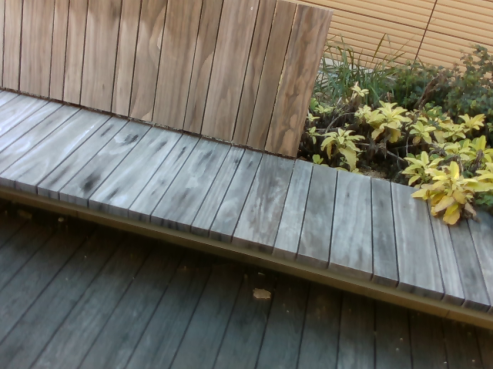

# Learning Topology from Synthetic Data for Unsupervised Depth Completion

Tensorflow implementation of *Learning Topology from Synthetic Data for Unsupervised Depth Completion*

Published in RA-L January 2021 and ICRA 2021

[[publication]](https://ieeexplore.ieee.org/document/9351588) [[arxiv]](https://arxiv.org/pdf/2106.02994v1.pdf) [[talk]](https://www.youtube.com/watch?v=zGKH-OKPJD4)

Tensorflow models have been tested on Ubuntu 16.04, 20.04 using Python 3.5, 3.6 Tensorflow 1.14, 1.15 on CUDA 10.0

PyTorch models have been tested on Ubuntu 20.04 using Python 3.7, 3.8 PyTorch 1.10 on CUDA 11.1

Authors: [Alex Wong](http://web.cs.ucla.edu/~alexw/), [Safa Cicek](https://bsafacicek.github.io/)

If this work is useful to you, please cite our paper:
```
@article{wong2021learning,
    title={Learning topology from synthetic data for unsupervised depth completion},
    author={Wong, Alex and Cicek, Safa and Soatto, Stefano},
    journal={IEEE Robotics and Automation Letters},
    volume={6},
    number={2},
    pages={1495--1502},
    year={2021},
    publisher={IEEE}
}
```

### Looking our latest work in unsupervised depth completion?

Checkout our ICCV 2021 oral paper, [KBNet][kbnet_github]: *Unsupervised Depth Completion with Calibrated Backprojection Layers*

[KBNet][kbnet_github] runs at 15 ms/frame (67 fps) and improves over ScaffNet on both indoor (VOID) and outdoor (KITTI) performance!

We have just released the PyTorch version of [VOICED](voiced_github): *Unsupervised Depth Completion from Visual Inertial Odometry*!

**Table of Contents**
1. [About sparse-to-dense depth completion](#about-sparse-to-dense)
2. [About ScaffNet and FusionNet](#about-scaffnet-fusionnet)
3. [Setting up for Tensorflow implementation](#setting-up-tensorflow)
4. [Setting up for PyTorch implementation](#setting-up-pytorch)
5. [Related projects](#related-projects)
6. [License and disclaimer](#license-disclaimer)

## About sparse-to-dense depth completion <a name="about-sparse-to-dense"></a>
In the sparse-to-dense depth completion problem, we seek to infer the dense depth map of a 3-D scene using an RGB image and its associated sparse depth measurements in the form of a sparse depth map, obtained either from computational methods such as SfM (Strcuture-from-Motion) or active sensors such as lidar or structured light sensors.

| *RGB image from the VOID dataset*    | *Our densified depth map -- colored and backprojected to 3D* |
| :----------------------------------------: | :--------------------------------------------------------: |
|  |  |

| *RGB image from the KITTI dataset*    | *Our densified depth map -- colored and backprojected to 3D* |
| :-----------------------------------------: | :--------------------------------------------------------: |
|  |  |

To follow the literature and benchmarks for this task, you may visit:
[Awesome State of Depth Completion](https://github.com/alexklwong/awesome-state-of-depth-completion)

## About ScaffNet and FusionNet <a name="about-scaffnet-fusionnet"></a>
We propose a method that leverages the abundance of synthetic data (where groundtruth comes for free) and unannotated real data to learn cross modal fusion for depth completion.

**The challenge of Sim2Real:** There exists a covariate shift, mostly photometric, between synthetic and real domains, making it difficult to transfer models trained on synthetic source data to the target real data. Instead one might observe that, unlike photometry, the geometry persists for a given scene across domains.
So we can bypass the photometric domain gap by learning the association *not* from photometry to geometry or from images to shapes, but from sparse geometry (point clouds) to topology by using the abundance of synthetic data. In doing so we can bypass the synthetic to real domain gap without having to face concerns about covariate shift and domain adaptation.

**ScaffNet:** The challenge of sparse-to-dense depth comppletion is precisely the sparsity. To learn a representation of the sparse point cloud that can capture the complex geometry of objects, we introduce *ScaffNet*, an encoder decoder network augmented with our version of Spatial Pyramid Pooling (SPP) module. Our SPP module performs max pooling with various kernel sizes to densify the inputs and to capture different receptive fields and learns to balance the tradeoff between density and details of the sparse point cloud.

**FusionNet:** Because the topology estimated by ScaffNet is only informed by sparse points, if there are very few points or no points at all then we can expect the performance of ScaffNet to degrade. This is where the image comes back into the picture. We propose a second network that refines the initial estimate by incorporating the information from the image to amend any mistakes. Here we show our full inference pipeline:

<p align="center">
    
</p>

First, ScaffNet estimates an initial scene topology from the sparse point cloud.
Then FusionNet performs cross modality fusion and learns the residual beta from the image to refine the coarse topology estimate. By learning the residual around the initial estimate, we alleviate Fusionnet from the need to learn depth from scratch, which allows us to achieve better results with fewer parameters and faster inference.

## Setting up for Tensorflow implementation <a name="setting-up-tensorflow"></a>
For the original Tensorflow implementation that was used in *Learning Topology from Synthetic Data for Unsupervised Depth Completion*, please visit [ScaffNet/FusionNet Tensorflow](tensorflow/README.md). Note that the Tensorflow implementation is written for Tensorflow 1 and not 2. We will stop support on the Tensorflow 1 version starting on this commit. We currently do not have plans to support Tensorflow 2, but may revisit this in the future if there is enough interest in that platform. For those who are interested in future versions of this work, we encourage you to use the PyTorch version (see below).

Note: Dataset set up and data handling of Tensorflow version follows the original version of the code. To ensure that the code works properly, please treat the `tensorflow` directory as the root of the Tensorflow code repository. Also, the Tensorflow version of this code was published using Virtual KITTI 1 for training ScaffNet, while the PyTorch version of this code uses Virtual KITTI 2.

## Setting up for PyTorch implementation <a name="setting-up-pytorch"></a>
We have released a PyTorch re-implementation of *Learning Topology from Synthetic Data for Unsupervised Depth Completion*. Although hyper-parameters may different, the implementation is faithful to the original -- the necessary change to reproduce the results may be due to subtle differences between Tensorflow and PyTorch platforms, and also that we use Virtual KITTI 2  instead of Virtual KITTI 1 and sequence 0 and 1 for SceneNet instead of just 0 for training ScaffNet. Please see [ScaffNet/FusionNet PyTorch](pytorch/README.md) for more source code and instructions. As our group have migrated to PyTorch as the main platform, we will continue to support this re-implementation, but will discontinue support for Tensorflow.

Note: The PyTorch version follows the implementation pattern in [KBNet][kbnet_github] and [MonDi][mondi_github] and hence dataset (KITTI, VOID, SceneNet, Virtual KITTI) setup and data loading functions will differ from the Tensorflow version. To ensure that the code works properly, please treat the `pytorch` directory as the root of the PyTorch code repository.

**Coming soon!** We will release pre-trained models for the PyTorch re-implementation in the upcoming months, stay tuned!

## Related projects <a name="related-projects"></a>
You may also find the following projects useful:

- [MonDi][mondi_github]: *Monitored Distillation for Positive Congruent Depth Completion (MonDi)*. A method for blind ensemble distillation that leverages a monitoring validation function to allow student models trained through the distillation process to retain strengths of teachers while minimizing distillation of their weaknesses. This work is published in the European Conference on Computer Vision (ECCV) 2022.
- [KBNet][kbnet_github]: *Unsupervised Depth Completion with Calibrated Backprojection Layers*. A fast (15 ms/frame) and accurate unsupervised sparse-to-dense depth completion method that introduces a calibrated backprojection layer that improves generalization across sensor platforms. This work is published as an *oral* paper in the International Conference on Computer Vision (ICCV) 2021.
- [ScaffNet][scaffnet_github]: *Learning Topology from Synthetic Data for Unsupervised Depth Completion*. An unsupervised sparse-to-dense depth completion method that first learns a map from sparse geometry to an initial dense topology from synthetic data (where ground truth comes for free) and amends the initial estimation by validating against the image. This work is published in the Robotics and Automation Letters (RA-L) 2021 and the International Conference on Robotics and Automation (ICRA) 2021.
- [AdaFrame][adaframe_github]: *Learning Topology from Synthetic Data for Unsupervised Depth Completion*. An adaptive framework for learning unsupervised sparse-to-dense depth completion that balances data fidelity and regularization objectives based on model performance on the data. This work is published in the Robotics and Automation Letters (RA-L) 2021 and the International Conference on Robotics and Automation (ICRA) 2021.
- [VOICED][voiced_github]: *Unsupervised Depth Completion from Visual Inertial Odometry*. An unsupervised sparse-to-dense depth completion method, developed by the authors. The paper introduces Scaffolding for depth completion and a light-weight network to refine it. This work is published in the Robotics and Automation Letters (RA-L) 2020 and the International Conference on Robotics and Automation (ICRA) 2020.
- [VOID][void_github]: from *Unsupervised Depth Completion from Visual Inertial Odometry*. A dataset, developed by the authors, containing indoor and outdoor scenes with non-trivial 6 degrees of freedom. The dataset is published along with this work in the Robotics and Automation Letters (RA-L) 2020 and the International Conference on Robotics and Automation (ICRA) 2020.
- [XIVO][xivo_github]: The Visual-Inertial Odometry system developed at UCLA Vision Lab. This work is built on top of XIVO. The VOID dataset used by this work also leverages XIVO to obtain sparse points and camera poses.
- [GeoSup][geosup_github]: *Geo-Supervised Visual Depth Prediction*. A single image depth prediction method developed by the authors, published in the Robotics and Automation Letters (RA-L) 2019 and the International Conference on Robotics and Automation (ICRA) 2019. This work was awarded **Best Paper in Robot Vision** at ICRA 2019.
- [AdaReg][adareg_github]: *Bilateral Cyclic Constraint and Adaptive Regularization for Unsupervised Monocular Depth Prediction.* A single image depth prediction method that introduces adaptive regularization. This work was published in the proceedings of Conference on Computer Vision and Pattern Recognition (CVPR) 2019.

We also have works in adversarial attacks on depth estimation methods and medical image segmentation:
- [SUPs][sups_github]: *Stereoscopic Universal Perturbations across Different Architectures and Datasets..* Universal advesarial perturbations and robust architectures for stereo depth estimation, published in the Proceedings of Computer Vision and Pattern Recognition (CVPR) 2022.
- [Stereopagnosia][stereopagnosia_github]: *Stereopagnosia: Fooling Stereo Networks with Adversarial Perturbations.* Adversarial perturbations for stereo depth estimation, published in the Proceedings of AAAI Conference on Artificial Intelligence (AAAI) 2021.
- [Targeted Attacks for Monodepth][targeted_attacks_monodepth_github]: *Targeted Adversarial Perturbations for Monocular Depth Prediction.* Targeted adversarial perturbations attacks for monocular depth estimation, published in the proceedings of Neural Information Processing Systems (NeurIPS) 2020.
- [SPiN][spin_github] : *Small Lesion Segmentation in Brain MRIs with Subpixel Embedding.* Subpixel architecture for segmenting ischemic stroke brain lesions in MRI images, published in the Proceedings of Medical Image Computing and Computer Assisted Intervention (MICCAI) Brain Lesion Workshop 2021 as an **oral paper**.

[kitti_dataset]: http://www.cvlibs.net/datasets/kitti/
[vkitti_dataset]: https://europe.naverlabs.com/research/computer-vision/proxy-virtual-worlds-vkitti-1/
[scenenet_dataset]: https://robotvault.bitbucket.io/scenenet-rgbd.html
[nyu_v2_dataset]: https://cs.nyu.edu/~silberman/datasets/nyu_depth_v2.html
[void_github]: https://github.com/alexklwong/void-dataset
[voiced_github]: https://github.com/alexklwong/unsupervised-depth-completion-visual-inertial-odometry
[scaffnet_github]: https://github.com/alexklwong/learning-topology-synthetic-data
[adaframe_github]: https://github.com/alexklwong/adaframe-depth-completion
[kbnet_github]: https://github.com/alexklwong/calibrated-backprojection-network
[mondi_github]: https://github.com/alexklwong/mondi-python
[xivo_github]: https://github.com/ucla-vision/xivo
[geosup_github]: https://github.com/feixh/GeoSup
[adareg_github]: https://github.com/alexklwong/adareg-monodispnet
[sups_github]: https://github.com/alexklwong/stereoscopic-universal-perturbations
[stereopagnosia_github]: https://github.com/alexklwong/stereopagnosia
[targeted_attacks_monodepth_github]: https://github.com/alexklwong/targeted-adversarial-perturbations-monocular-depth
[spin_github]: https://github.com/alexklwong/subpixel-embedding-segmentation

## License and disclaimer <a name="license-disclaimer"></a>
This software is property of the UC Regents, and is provided free of charge for research purposes only. It comes with no warranties, expressed or implied, according to these [terms and conditions](license). For commercial use, please contact [UCLA TDG](https://tdg.ucla.edu).
